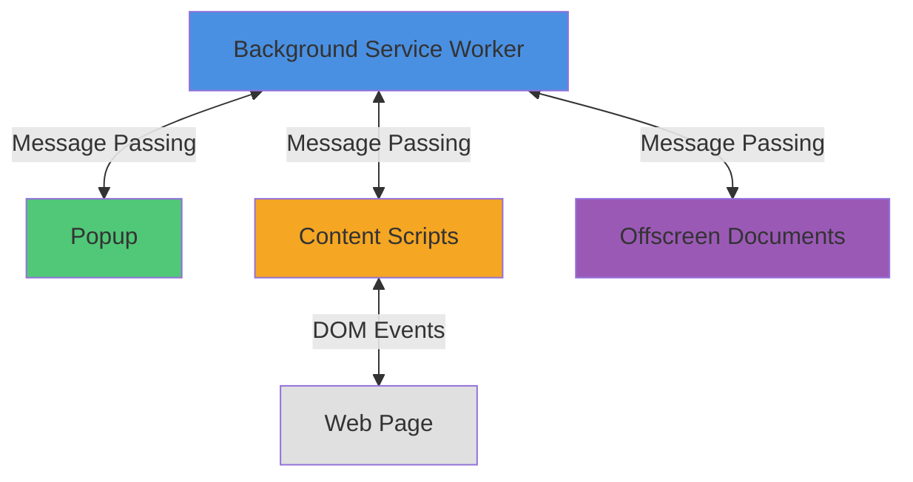

The browser extension is built with a multi-context architecture that separates concerns between the background service worker, popup UI, content scripts, and web pages.

## Execution Contexts

The extension runs in multiple isolated contexts that communicate via message passing:



### Background Service Worker

**Entry Point:** `src/platform/background.ts`

**Lifecycle:** In Manifest V3, the background context runs as a service worker that can be terminated at any time by the browser.

```typescript
// src/platform/background.ts
import MainBackground from "../background/main.background";

const logService = new ConsoleLogService(false);
const bitwardenMain = ((self as any).bitwardenMain = new MainBackground());
bitwardenMain.bootstrap().catch((error) => logService.error(error));
```

**Responsibilities:**
- Core business logic and service initialization
- Vault encryption/decryption
- API communication
- Storage management
- Background sync operations

**Key Constraints:**
- Can be terminated at any time (Manifest V3)
- Cannot directly access DOM
- Must use message passing to communicate with popup and content scripts

### Popup

**Entry Point:** `src/popup/main.ts`

**Framework:** Angular application

**Lifecycle:** Created when user clicks extension icon, destroyed when closed

```typescript
// src/popup/main.ts
import { enableProdMode } from "@angular/core";
import { platformBrowserDynamic } from "@angular/platform-browser-dynamic";
import { AppModule } from "./app.module";

if (process.env.ENV === "production") {
  enableProdMode();
}

function init() {
  void platformBrowserDynamic().bootstrapModule(AppModule);
}

init();
```

**Responsibilities:**
- User interface for vault access
- Password generation
- Settings management
- Quick actions (autofill, copy credentials)

**Key Constraints:**
- Must clean up event listeners to prevent memory leaks (especially Safari)
- Should use `ZonedMessageListenerService` for Angular change detection
- Limited lifetime - can be closed at any time

### Content Scripts

**Location:** `src/autofill/`

**Injection:** Defined in manifest, injected into web pages

```json
// manifest.v3.json
"content_scripts": [
  {
    "all_frames": false,
    "js": ["content/content-message-handler.js"],
    "matches": ["*://*/*", "file:///*"],
    "run_at": "document_start"
  },
  {
    "all_frames": true,
    "css": ["content/autofill.css"],
    "js": ["content/trigger-autofill-script-injection.js"],
    "matches": ["*://*/*", "file:///*"],
    "run_at": "document_start"
  }
]
```

**Responsibilities:**
- Form field detection
- Autofill triggering
- Page script communication
- FIDO2/WebAuthn interception

### Offscreen Documents

**Purpose:** Manifest V3 workaround for clipboard operations and DOM APIs

**Location:** `src/platform/offscreen-document/`

Offscreen documents provide a hidden HTML context for operations that require DOM access:

```typescript
// src/platform/offscreen-document/offscreen-document.ts
BrowserApi.messageListener("offscreen-document", this.handleExtensionMessage);
```

## BrowserApi Abstraction

**Location:** `src/platform/browser/browser-api.ts`

The `BrowserApi` class is a critical abstraction layer that provides cross-browser compatibility.

### Critical Rules

<Warning>
**NEVER** use `chrome.*` or `browser.*` APIs directly in business logic. Always use the `BrowserApi` abstraction for cross-browser compatibility (Chrome/Firefox/Safari/Opera).
</Warning>

### Core Methods

#### Tab Management

```typescript
// Get current active tab
const tab = await BrowserApi.getTabFromCurrentWindow();

// Query tabs
const tabs = await BrowserApi.tabsQuery({ active: true });

// Safari-specific tab query (handles Safari bugs)
const tab = await BrowserApi.tabsQueryFirstCurrentWindowForSafari({
  active: true,
  currentWindow: true,
});
```

<Warning>
**Safari Tab Query Bug**: Safari can return tabs from multiple windows even when `currentWindow: true` is specified. Always use `BrowserApi.tabsQueryFirstCurrentWindowForSafari()` when querying the current window in Safari to avoid incorrect results.
</Warning>

#### Message Passing

```typescript
// Send message to background
await BrowserApi.sendMessage("commandName", { data: "value" });

// Send message with response
const response = await BrowserApi.sendMessageWithResponse<ResponseType>(
  "commandName",
  { data: "value" }
);

// Send message to tab
await BrowserApi.tabSendMessage(tab, { command: "autofill", data: loginData });
```

#### Event Listeners

<Warning>
**Safari Memory Leaks**: Safari requires manual cleanup of event listeners in popup contexts. Always use `BrowserApi.addListener()` instead of native `chrome.*.addListener()` or `browser.*.addListener()` to ensure proper cleanup.
</Warning>

```typescript
// ✅ Correct - Use BrowserApi.addListener()
BrowserApi.addListener(chrome.runtime.onMessage, callback);

// ✅ For popup components, use ZonedMessageListenerService
this.zonedMessageListener.messageListener("vaultLocked", (message) => {
  // Handle message inside Angular zone
});

// ❌ Wrong - Direct listener registration in Safari popup
chrome.runtime.onMessage.addListener(callback); // Memory leak!
```

The `BrowserApi.addListener()` method automatically tracks and removes listeners on Safari popup unload:

```typescript
// From browser-api.ts:548
static addListener<T extends (...args: readonly any[]) => any>(
  event: chrome.events.Event<T>,
  callback: T,
) {
  event.addListener(callback);

  if (BrowserApi.isSafariApi && !BrowserApi.isBackgroundPage(self)) {
    BrowserApi.trackedChromeEventListeners.push([event, callback]);
    BrowserApi.setupUnloadListeners();
  }
}
```

#### Platform Detection

```typescript
// Check manifest version
if (BrowserApi.isManifestVersion(3)) {
  // Use Manifest V3 APIs
}

// Check browser type
if (BrowserApi.isSafariApi) {
  // Safari-specific code
}

if (BrowserApi.isFirefoxOnAndroid) {
  // Firefox Android-specific code
}
```

### Browser-Specific Implementations

The `BrowserApi` class detects the browser environment:

```typescript
// From browser-api.ts:17-21
static isWebExtensionsApi: boolean = typeof browser !== "undefined";
static isSafariApi: boolean = isBrowserSafariApi();
static isChromeApi: boolean = !BrowserApi.isSafariApi && typeof chrome !== "undefined";
static isFirefoxOnAndroid: boolean =
  navigator.userAgent.indexOf("Firefox/") !== -1 && navigator.userAgent.indexOf("Android") !== -1;
```

## Message Passing Architecture

Since Manifest V3 uses service workers, all communication between contexts uses message passing.

### Background ↔ Popup Communication

**From Popup to Background:**

```typescript
// src/popup/services/
await BrowserApi.sendMessage("syncVault");
```

**From Background to Popup:**

```typescript
// src/background/
const popupViews = BrowserApi.getExtensionViews({ type: "popup" });
if (popupViews.length > 0) {
  await BrowserApi.sendMessage("vaultLocked");
}
```

**In Popup (receiving messages):**

```typescript
// Use ZonedMessageListenerService for Angular components
this.zonedMessageListener.messageListener("vaultLocked", (message) => {
  this.ngZone.run(() => {
    // Handle inside Angular zone for change detection
    this.handleVaultLocked();
  });
});
```

### Background ↔ Content Script Communication

**From Background to Content Script:**

```typescript
const tab = await BrowserApi.getTab(tabId);
await BrowserApi.tabSendMessage(tab, {
  command: "autofillLogin",
  data: loginData,
});
```

**From Content Script to Background:**

```typescript
// src/autofill/content/
chrome.runtime.sendMessage({
  command: "detectFormFields",
  fields: detectedFields,
});
```

### Message Listener Service

**For Popup Components:**

Use `ZonedMessageListenerService` to ensure Angular change detection:

```typescript
// src/platform/browser/zoned-message-listener.service.ts
@Injectable({ providedIn: "root" })
export class ZonedMessageListenerService {
  constructor(private ngZone: NgZone) {}

  messageListener(
    name: string,
    callback: (message: any, sender: chrome.runtime.MessageSender, sendResponse: any) => boolean | void,
  ) {
    BrowserApi.messageListener(name, (message, sender, sendResponse) => {
      return this.ngZone.run(() => callback(message, sender, sendResponse));
    });
  }
}
```

**For Background Services:**

Use `BrowserApi.messageListener()` directly:

```typescript
BrowserApi.messageListener("platform.ipc", (message, sender) => {
  if (message.command === "getData") {
    return { success: true, data: this.data };
  }
});
```

## Storage Architecture

The extension uses multiple storage layers:

### Storage Types

- **Local Storage** - `chrome.storage.local` for persistent data
- **Session Storage** - `chrome.storage.session` for temporary data (MV3)
- **Memory Storage** - In-memory state with message passing synchronization
- **Local Backed Session Storage** - Session storage with local storage fallback

### Storage Services

```typescript
// Memory storage with port-based synchronization
export class ForegroundMemoryStorageService {
  private port: chrome.runtime.Port;

  constructor() {
    this.port = chrome.runtime.connect({ name: "foreground-memory-storage" });
    this.port.onMessage.addListener(this.handleMessage);
  }

  private sendMessage(data: Omit<MemoryStoragePortMessage, "originator">) {
    this.port.postMessage({ ...data, originator: "foreground" });
  }
}
```

## Manifest V3 Constraints

### Service Worker Lifecycle

<Warning>
**Service Workers can be terminated at any time.** The background context is not persistent in Manifest V3. Do not assume it will stay alive indefinitely.
</Warning>

```typescript
// ❌ Wrong - Assumes background page persists
const backgroundPage = chrome.extension.getBackgroundPage(); // Returns null in MV3
backgroundPage.someFunction();

// ✅ Correct - Use message passing
await BrowserApi.sendMessage("performAction");
```

### Background Page Access

From `browser-api.ts:434`:

```typescript
/**
 * Gets the background page for the extension. This method is
 * not valid within manifest v3 background service workers. As
 * a result, it will return null when called from that context.
 */
static getBackgroundPage(): any {
  if (typeof chrome.extension.getBackgroundPage === "undefined") {
    return null;
  }

  return chrome.extension.getBackgroundPage();
}
```

## Next Steps

- [Manifest V3 Migration](/apps/browser/manifest-v3) - Detailed Manifest V3 changes
- [Building](/apps/browser/building) - Build the extension for development
