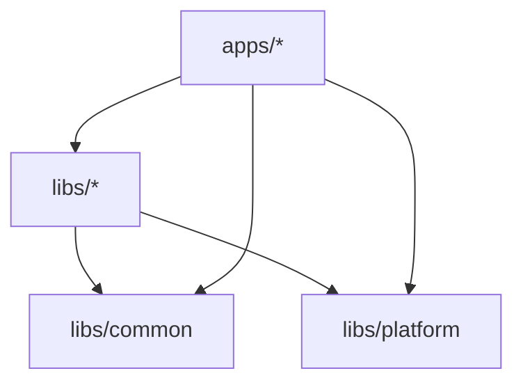

The Bitwarden Clients repository is organized as a monorepo containing multiple applications and shared libraries. This structure promotes code reuse, maintains consistency, and enables efficient development across multiple platforms.

## Workspace Layout

The repository follows a clear separation between deployable applications and reusable libraries:

```
bitwarden/clients/
├── apps/              # Deployable applications
│   ├── browser/       # Browser extension (Chrome, Firefox, Safari, etc.)
│   ├── cli/           # Command-line interface
│   ├── desktop/       # Desktop application (Electron)
│   └── web/           # Web vault application
├── libs/              # Shared libraries
│   ├── angular/       # Angular framework utilities
│   ├── auth/          # Authentication domain
│   ├── common/        # Core business logic
│   ├── components/    # UI component library
│   ├── platform/      # Platform abstractions
│   ├── vault/         # Vault domain
│   └── tools/         # Generator, import/export tools
└── bitwarden_license/ # Enterprise/commercial features
```

## Apps vs Libs

### Applications (`apps/`)

Applications are the final, deployable artifacts. Each app:

- **Has its own build configuration** (webpack, tsconfig, etc.)
- **Targets a specific platform** (browser extension, desktop app, web app, CLI)
- **Consumes shared libraries** from `libs/`
- **Contains platform-specific code** that doesn't belong in shared libraries

**Available Applications:**

| Application | Description | Technology |
|-------------|-------------|------------|
| `browser` | Browser extension for Chrome, Firefox, Safari, Opera | Angular + WebExtensions API |
| `cli` | Command-line interface for automation and scripting | Node.js + Commander |
| `desktop` | Desktop application for Windows, macOS, Linux | Angular + Electron |
| `web` | Web vault accessible via browser | Angular |

### Libraries (`libs/`)

 Libraries contain reusable code shared across multiple applications. Each library:

- **Focuses on a specific domain or functionality**
- **Has minimal dependencies** on other libraries
- **Exports a clear public API** through index files
- **Is framework-agnostic when possible** (except Angular-specific libs)

**Key Libraries:**

<AccordionGroup>
  <Accordion title="Domain Libraries">
    - `auth` - Authentication, login strategies, SSO, 2FA
    - `vault` - Cipher management, folders, collections
    - `admin-console` - Organization and provider management
    - `billing` - Subscription and payment handling
    - `key-management` - Cryptographic operations, key derivation
  </Accordion>

  <Accordion title="Platform Libraries">
    - `common` - Core business logic, models, services
    - `platform` - Platform abstractions (storage, crypto, state)
    - `angular` - Angular-specific utilities and base classes
    - `node` - Node.js-specific implementations
  </Accordion>

  <Accordion title="UI Libraries">
    - `components` - Shared UI component library (Storybook)
    - `assets` - Icons, images, fonts
  </Accordion>

  <Accordion title="Utility Libraries">
    - `tools` - Generator, importer, exporter functionality
    - `state` - State management primitives
    - `serialization` - JSON serialization utilities
    - `guid` - GUID type definitions and utilities
  </Accordion>

  <Accordion title="Testing Libraries">
    - `core-test-utils` - Common testing utilities
    - `state-test-utils` - State testing helpers
    - `storage-test-utils` - Storage mocking utilities
  </Accordion>
</AccordionGroup>

## Workspace Configuration

The monorepo uses npm workspaces defined in `package.json`:

```json package.json
{
  "name": "@bitwarden/clients",
  "workspaces": [
    "apps/*",
    "apps/desktop/desktop_native/napi",
    "libs/**/*"
  ]
}
```

This configuration:

- **Hoists dependencies** to the root `node_modules` for efficiency
- **Links local packages** automatically (no need for `npm link`)
- **Enables workspace commands** like `npm run build --workspace=@bitwarden/auth`

## TypeScript Path Mappings

The `tsconfig.base.json` defines path aliases for all libraries, enabling clean imports across the monorepo:

```json tsconfig.base.json
{
  "compilerOptions": {
    "baseUrl": ".",
    "paths": {
      "@bitwarden/admin-console/common": ["./libs/admin-console/src/common"],
      "@bitwarden/angular/*": ["./libs/angular/src/*"],
      "@bitwarden/auth/angular": ["./libs/auth/src/angular"],
      "@bitwarden/auth/common": ["./libs/auth/src/common"],
      "@bitwarden/common/*": ["./libs/common/src/*"],
      "@bitwarden/components": ["./libs/components/src"],
      "@bitwarden/platform": ["./libs/platform/src"],
      "@bitwarden/vault": ["./libs/vault/src"]
      // ... many more
    }
  }
}
```

**Usage Example:**

```typescript
// Instead of:
import { AuthService } from '../../../../libs/auth/src/common/services/auth.service';

// Use clean path alias:
import { AuthService } from '@bitwarden/auth/common';
```

## Project Structure Conventions

Each library follows a consistent internal structure:

```
libs/auth/
├── src/
│   ├── angular/          # Angular-specific code
│   │   ├── components/
│   │   └── services/
│   ├── common/           # Framework-agnostic code
│   │   ├── abstractions/ # Interface definitions
│   │   ├── models/       # Data models
│   │   └── services/     # Service implementations
│   └── index.ts          # Public API exports
├── package.json          # Package metadata
├── project.json          # Nx project configuration
├── tsconfig.json         # TypeScript config
└── README.md             # Library documentation
```

### Key Conventions:

<CardGroup cols={2}>
  <Card title="Abstractions First" icon="file-contract">
    Define interfaces in `abstractions/` folders before implementing services
  </Card>
  <Card title="Index Exports" icon="file-export">
    Only export public APIs through `index.ts` - keep internals private
  </Card>
  <Card title="Framework Separation" icon="layer-group">
    Separate Angular code (`angular/`) from framework-agnostic code (`common/`)
  </Card>
  <Card title="Colocation" icon="folder">
    Keep related files together (model, service, tests in same folder)
  </Card>
</CardGroup>

## Dependency Guidelines

### Allowed Dependencies:



- **Apps can depend on any library**
- **Libraries should minimize cross-dependencies**
- **Avoid circular dependencies** between libraries
- **Platform libraries** (`common`, `platform`) should have minimal dependencies

### Dependency Anti-Patterns:

<Warning>
  **Avoid These Patterns:**
  
  - Libraries depending on apps
  - Circular dependencies between libraries
  - Direct imports from library internals (use index exports)
  - Framework-specific code in `common/` folders
</Warning>

## Enterprise Code Organization

Enterprise/commercial features live in `bitwarden_license/`:

```
bitwarden_license/
├── bit-common/      # Enterprise common code
├── bit-web/         # Enterprise web features
├── bit-cli/         # Enterprise CLI features
└── README.md
```

This separation:

- **Maintains clear licensing boundaries**
- **Enables building GPL-only versions** by excluding this directory
- **Follows the same organizational patterns** as the open-source code

## Adding New Code

### When to Create a New Library:

<Steps>
  <Step title="Identify the domain">
    Does your code represent a distinct business domain (auth, vault, billing)?
  </Step>
  <Step title="Check for reusability">
    Will this code be used by multiple applications?
  </Step>
  <Step title="Consider boundaries">
    Does it have clear boundaries with minimal dependencies?
  </Step>
  <Step title="Evaluate size">
    Is it substantial enough to warrant a separate library?
  </Step>
</Steps>

If all answers are yes, create a new library. Otherwise, add to an existing library or app.

### When to Add to an Existing App:

- Platform-specific implementation details
- Application-specific UI components
- Integration code that glues libraries together
- Code that will never be shared

## Best Practices

<CodeGroup>
```typescript Good Example
// libs/auth/src/common/abstractions/auth.service.ts
export abstract class AuthService {
  abstract login(email: string, password: string): Promise<void>;
}

// libs/auth/src/common/services/auth.service.ts
export class AuthServiceImplementation implements AuthService {
  async login(email: string, password: string): Promise<void> {
    // Implementation
  }
}

// libs/auth/src/index.ts
export { AuthService } from './common/abstractions/auth.service';
export { AuthServiceImplementation } from './common/services/auth.service';
```

```typescript Bad Example
// ❌ Don't expose implementation details
export { AuthServicePrivateHelper } from './common/services/helpers';

// ❌ Don't create circular dependencies
import { VaultService } from '@bitwarden/vault';
import { AuthService } from '@bitwarden/auth'; // in vault library

// ❌ Don't bypass index exports
import { AuthServiceImplementation } from '@bitwarden/auth/common/services/auth.service';
```
</CodeGroup>

## Next Steps

<CardGroup cols={2}>
  <Card title="Nx Workspace" icon="diagram-project" href="/guide/nx-workspace">
    Learn how Nx manages builds, caching, and task execution
  </Card>
  <Card title="Dependency Injection" icon="syringe" href="/guide/dependency-injection">
    Understand service registration and DI patterns
  </Card>
</CardGroup>