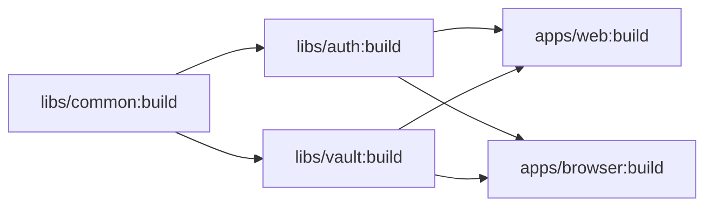

The Bitwarden Clients repository uses [Nx](https://nx.dev) as its monorepo build system. Nx provides intelligent build orchestration, computation caching, and task scheduling across all applications and libraries.

## Nx Configuration

The primary Nx configuration lives in `nx.json` at the repository root:

```json nx.json
{
  "$schema": "./node_modules/nx/schemas/nx-schema.json",
  "cacheDirectory": ".nx/cache",
  "defaultBase": "main",
  "namedInputs": {
    "default": ["{projectRoot}/**/*", "sharedGlobals"],
    "production": [
      "default",
      "!{projectRoot}/**/*.spec.ts",
      "!{projectRoot}/tsconfig.spec.json"
    ],
    "sharedGlobals": [
      "{workspaceRoot}/tsconfig.base.json",
      "{workspaceRoot}/package.json"
    ]
  },
  "plugins": [
    {
      "plugin": "@nx/js",
      "options": {
        "compiler": "tsc",
        "configName": "tsconfig.lib.json",
        "targetName": "build"
      }
    },
    {
      "plugin": "@nx/jest/plugin",
      "options": {
        "targetName": "test"
      }
    },
    {
      "plugin": "@nx/eslint/plugin",
      "options": {
        "targetName": "lint"
      }
    },
    "@bitwarden/nx-plugin"
  ],
  "parallel": 4,
  "targetDefaults": {
    "build": {
      "dependsOn": ["^build"],
      "inputs": ["production", "^production"],
      "outputs": ["{options.outputPath}"],
      "cache": true
    }
  }
}
```

## Key Concepts

### Named Inputs

Named inputs define file sets that Nx uses to determine if a task needs to be re-run:

<AccordionGroup>
  <Accordion title="default">
    All files in the project root plus shared global files:
    ```json
    "default": ["{projectRoot}/**/*", "sharedGlobals"]
    ```
  </Accordion>

  <Accordion title="production">
    All default files excluding test files:
    ```json
    "production": [
      "default",
      "!{projectRoot}/**/*.spec.ts",
      "!{projectRoot}/tsconfig.spec.json"
    ]
    ```
    Used for production builds to avoid cache invalidation from test changes.
  </Accordion>

  <Accordion title="sharedGlobals">
    Root configuration files that affect all projects:
    ```json
    "sharedGlobals": [
      "{workspaceRoot}/tsconfig.base.json",
      "{workspaceRoot}/package.json"
    ]
    ```
    Changes to these files invalidate all project caches.
  </Accordion>
</AccordionGroup>

### Target Defaults

Target defaults apply configuration to all projects with a matching target:

```json
"targetDefaults": {
  "build": {
    "dependsOn": ["^build"],        // Build dependencies first
    "inputs": ["production", "^production"], // Cache based on production inputs
    "outputs": ["{options.outputPath}"],    // Cache output directory
    "cache": true                     // Enable caching
  }
}
```

**What this means:**

- `"dependsOn": ["^build"]` - Build all dependencies before building this project (the `^` means upstream dependencies)
- `"inputs"` - Use production files for cache key calculation
- `"outputs"` - Cache the build output directory
- `"cache": true` - Enable Nx computation caching

## Project Configuration

Each library has its own `project.json` defining available targets and configuration:

```json libs/auth/project.json
{
  "name": "@bitwarden/auth",
  "$schema": "../../node_modules/nx/schemas/project-schema.json",
  "sourceRoot": "libs/auth/src",
  "projectType": "library",
  "tags": ["scope:auth", "type:lib"],
  "targets": {
    "build": {
      "executor": "nx:run-script",
      "dependsOn": [],
      "options": {
        "script": "build"
      }
    },
    "build:watch": {
      "executor": "nx:run-script",
      "options": {
        "script": "build:watch"
      }
    },
    "test": {
      "executor": "nx:run-script",
      "options": {
        "script": "test"
      }
    },
    "lint": {
      "executor": "@nx/eslint:lint",
      "outputs": ["{options.outputFile}"],
      "options": {
        "lintFilePatterns": ["libs/auth/**/*.ts"]
      }
    }
  }
}
```

### Project Tags

Tags enable enforcement of architectural boundaries:

```json
"tags": ["scope:auth", "type:lib"]
```

You can create lint rules to prevent unwanted dependencies:

```javascript .eslintrc.js
{
  "@nx/enforce-module-boundaries": [
    "error",
    {
      "depConstraints": [
        {
          "sourceTag": "type:lib",
          "onlyDependOnLibsWithTags": ["type:lib"]
        }
      ]
    }
  ]
}
```

## Running Tasks

### Single Project

Run a target for a specific project:

```bash
# Run build target for auth library
nx build @bitwarden/auth

# Run tests for vault library
nx test @bitwarden/vault

# Lint the components library
nx lint @bitwarden/components
```

### Multiple Projects

Run a target across multiple projects:

```bash
# Run build for all projects
nx run-many -t build

# Run tests for all projects
nx run-many -t test

# Run lint for all projects
nx run-many -t lint

# Run build for specific projects
nx run-many -t build -p @bitwarden/auth @bitwarden/vault
```

### Affected Projects

Run tasks only for projects affected by changes:

```bash
# Test only affected projects
nx affected -t test

# Build only affected projects
nx affected -t build

# Lint only affected projects
nx affected -t lint

# Compare against a specific base branch
nx affected -t test --base=origin/main
```

<Info>
**How "affected" works:**

Nx analyzes your git changes and the dependency graph to determine which projects are affected. If you modify `libs/auth`, Nx knows that `apps/web`, `apps/browser`, `apps/desktop`, and `apps/cli` depend on it and marks them as affected.
</Info>

### Parallel Execution

Nx can run tasks in parallel for better performance:

```json nx.json
{
  "parallel": 4  // Run up to 4 tasks in parallel
}
```

Override for specific commands:

```bash
# Run with maximum parallelism
nx run-many -t test --parallel=8

# Run serially (no parallelism)
nx run-many -t build --parallel=1
```

## Computation Caching

Nx caches task outputs to avoid redundant work. When you run a task, Nx:

1. **Computes a hash** based on:
   - Input files (defined by `inputs`)
   - Task configuration
   - Dependency outputs (if `dependsOn` specified)

2. **Checks the cache** for matching hash

3. **Restores from cache** if found, or **runs the task** and caches the result

### Cache Directory

Cached outputs are stored in `.nx/cache`:

```bash
.nx/
└── cache/
    ├── <hash1>/
    │   ├── outputs/
    │   └── terminalOutput
    └── <hash2>/
        ├── outputs/
        └── terminalOutput
```

<Warning>
Add `.nx/cache` to `.gitignore` - cache is local and should not be committed.
</Warning>

### Clearing Cache

```bash
# Clear local cache
nx reset

# Or manually delete cache directory
rm -rf .nx/cache
```

### Skip Cache

Force execution even if cache exists:

```bash
# Skip cache for specific command
nx build @bitwarden/auth --skip-nx-cache

# Skip cache for all affected projects
nx affected -t build --skip-nx-cache
```

## Task Dependencies

Define task execution order with `dependsOn`:

### Upstream Dependencies (`^`)

```json
"build": {
  "dependsOn": ["^build"]
}
```

Build all upstream dependencies first. If `apps/web` depends on `libs/auth`, running `nx build web` will first build `@bitwarden/auth`.

### Same-Project Dependencies

```json
"build": {
  "dependsOn": ["generate-types"]
}
```

Run `generate-types` target in the same project before `build`.

### Combined Dependencies

```json
"build": {
  "dependsOn": ["^build", "generate-types"]
}
```

Run `generate-types` locally AND build upstream dependencies.

## Custom Plugins

The repository includes a custom Nx plugin:

```json nx.json
{
  "plugins": [
    "@bitwarden/nx-plugin"
  ]
}
```

This plugin lives in `libs/nx-plugin` and provides:

- Custom executors for Bitwarden-specific build tasks
- Generators for creating new libraries and applications
- Additional linting rules and checks

See `libs/nx-plugin/README.md` for details.

## Task Pipelines

Nx automatically creates a task pipeline based on dependencies:



Running `nx build web` executes:

1. `nx build @bitwarden/common`
2. `nx build @bitwarden/auth` and `nx build @bitwarden/vault` (parallel)
3. `nx build web`

Nx optimizes the pipeline to maximize parallelism while respecting dependencies.

## Visualizing the Graph

Nx can generate a visual dependency graph:

```bash
# Open interactive graph in browser
nx graph

# Show graph for affected projects
nx affected:graph

# Generate static graph image
nx graph --file=graph.html
```

The graph shows:

- All projects in the workspace
- Dependencies between projects
- Affected projects (when using `affected:graph`)

## Common Workflows

### Development Workflow

```bash
# 1. Make changes to code
vim libs/auth/src/common/services/auth.service.ts

# 2. Run tests for affected projects
nx affected -t test

# 3. Lint affected code
nx affected -t lint

# 4. Build affected projects
nx affected -t build
```

### CI/CD Workflow

```bash
# 1. Determine what changed
nx affected:apps --base=origin/main

# 2. Run tests for affected projects
nx affected -t test --base=origin/main --parallel=8

# 3. Build affected projects
nx affected -t build --base=origin/main --parallel=8 --configuration=production

# 4. Deploy affected apps
# (custom deployment scripts)
```

### Full Rebuild

```bash
# Clear cache and rebuild everything
nx reset
nx run-many -t build --all
```

## Performance Optimization

<CardGroup cols={2}>
  <Card title="Use Affected Commands" icon="filter">
    Only build/test what changed: `nx affected -t test`
  </Card>
  <Card title="Enable Caching" icon="database">
    Ensure `cache: true` in target definitions
  </Card>
  <Card title="Increase Parallelism" icon="diagram-project">
    Use `--parallel=8` for CI environments with more CPU cores
  </Card>
  <Card title="Optimize Inputs" icon="file-contract">
    Exclude unnecessary files from `inputs` to improve cache hit rate
  </Card>
</CardGroup>

## Integration with Angular

Angular projects use `angular.json` alongside Nx configuration:

```json angular.json
{
  "projects": {
    "web": {
      "projectType": "application",
      "root": "apps/web",
      "sourceRoot": "apps/web/src",
      "architect": {
        "build": {
          "builder": "@angular-devkit/build-angular:browser",
          "options": {
            "outputPath": "dist/web",
            "index": "apps/web/src/index.html",
            "main": "apps/web/src/main.ts"
          }
        }
      }
    }
  }
}
```

Nx integrates with Angular CLI:

```bash
# These commands are equivalent:
nx build web
ng build web

# Nx adds caching and affected detection
nx affected -t build  # Not available in ng
```

## Troubleshooting

<AccordionGroup>
  <Accordion title="Cache not being used">
    **Symptoms:** Tasks always run even when nothing changed.

    **Solutions:**
    - Verify `cache: true` in target configuration
    - Check that `inputs` are defined correctly
    - Run `nx reset` to clear corrupted cache
    - Ensure timestamps are stable (watch for tools that modify files)
  </Accordion>

  <Accordion title="Dependency graph incorrect">
    **Symptoms:** Affected detection misses dependencies or includes too much.

    **Solutions:**
    - Run `nx graph` to visualize actual dependencies
    - Check `tsconfig.base.json` path mappings are correct
    - Verify imports use path aliases, not relative paths
    - Update `nx.json` if you've added new projects
  </Accordion>

  <Accordion title="Tasks running in wrong order">
    **Symptoms:** Build fails because dependencies aren't built first.

    **Solutions:**
    - Add `"dependsOn": ["^build"]` to target configuration
    - Check that dependency relationships are correct in code
    - Verify `project.json` files have correct dependencies
  </Accordion>
</AccordionGroup>

## Best Practices

<Steps>
  <Step title="Use affected commands in development">
    `nx affected -t test` is faster than testing everything
  </Step>
  <Step title="Keep tasks cacheable">
    Avoid non-deterministic operations (timestamps, random values) in build outputs
  </Step>
  <Step title="Define clear inputs">
    Specify exactly which files affect each task to maximize cache hits
  </Step>
  <Step title="Leverage parallelism">
    Let Nx run independent tasks in parallel - don't serialize unnecessarily
  </Step>
  <Step title="Monitor cache effectiveness">
    Run with `NX_VERBOSE_LOGGING=true` to see cache hits/misses
  </Step>
</Steps>

## Next Steps

<CardGroup cols={2}>
  <Card title="Dependency Injection" icon="syringe" href="/guide/dependency-injection">
    Learn how services are registered and injected
  </Card>
  <Card title="Monorepo Structure" icon="folder-tree" href="/guide/monorepo-structure">
    Understand the workspace organization
  </Card>
</CardGroup>

## Additional Resources

- [Nx Documentation](https://nx.dev)
- [Nx Computation Caching](https://nx.dev/concepts/how-caching-works)
- [Task Pipeline Configuration](https://nx.dev/concepts/task-pipeline-configuration)